# Vibe Marketing with OCTO — Architecture Diagram

> Generated: 2026-06-09  
> Source: Full codebase read — all diagrams and tables derived from actual code, not blueprints.

---

## System Overview

```mermaid
flowchart TD
    %% -------------------------------------------------------
    %% EXTERNAL DATA SOURCES
    %% -------------------------------------------------------
    subgraph EXT["EXTERNAL SERVICES"]
        direction LR
        BQ_KB["BigQuery (read-only)\nwb-tian-pr-d0dbe6\n.wb_tian_pr_dataset.campaign_knowledge"]
        BQ_DEPLOY["BigQuery (read-only)\nbi-srv-hsmdet-pr-7b9def\n.campaign_data.bq_plan_camp_deploy_mdc"]
        BQ_ADOBE["BigQuery (read-only)\nbi-srv-hsmdet-pr-7b9def.adobe\n(INFORMATION_SCHEMA views)"]
        BQ_RUNTIME["BigQuery (read-only — runtime)\nadobe.bq_fda_mob_mobility_base\nadobe.bq_fda_current_model_score_master_view\ngch_current.bq_campaign_segment / _communication / _description"]
        FUELIX["Fuel iX API\nhttps://api.fuelix.ai/v1/chat/completions\nModel: claude-sonnet-4\nAuth: FUELIX_API_KEY"]
        GSHEETS["Google Workspace\nSheets API v4 / Docs / Drive\nAuth: ADC (gcloud)"]
    end

    %% -------------------------------------------------------
    %% KNOWLEDGE INGESTION (offline, manual trigger)
    %% -------------------------------------------------------
    subgraph INGEST["KNOWLEDGE INGESTION — Offline / Manual"]
        KA["KnowledgeAgent\nknowledge_base/vibe_octo_knowledge.py\npython -m knowledge_base.vibe_octo_knowledge --full-refresh"]
        BF["BriefFetcher\nVibe OCTO Nexus/core/brief_fetcher.py\nFetches Sheets / Docs / Drive / PDF\nIn-memory only — never persisted"]
        CM["ColumnMapper\nknowledge_base/column_mapper.py\nResolves BQ column names via pattern matching"]
        SDL_ING["SchemaDiscoveryLayer\nschema_discovery/discovery_layer.py\nINFORMATION_SCHEMA → adobe_schema.json"]
    end

    %% -------------------------------------------------------
    %% KNOWLEDGE LAYER (disk artifacts, shared foundation)
    %% -------------------------------------------------------
    subgraph KB["KNOWLEDGE LAYER — Consulted on Every Request"]
        direction TB
        SKI["semantic_knowledge_index.json\nGOLD records: targeting_summary, segment_summary, brief_text\nBRONZE records: schema-only (no summaries)\ngold_count, bronze_count, generated_at"]
        AS_ART["knowledge_base/artifacts/adobe_schema.json\nViews + columns from INFORMATION_SCHEMA\nproject, dataset, snapshot_at"]
        CCP["knowledge_base/artifacts/cross_campaign_patterns.json\nCross-campaign targeting patterns (GOLD-derived)\nUsed in classify_intent + answer_general_question"]
        BR_FILE["business_rules.json\nHuman-verified BusinessRule objects\nExtracted by FeedbackAgent after HITL NO\nApplied on EVERY request with campaign context"]
        GL_FILE["glossary.json\nAcronyms (PFE, KI, TWA, AALBAU)\nCampaign configs, user_defined_terms\nAlways loaded for intent classification"]
        VAR_FILE["verified_app_registry.json\nHITL YES: confirmed specs + targeting/segment summaries\nHITL NO: correction_text override for next Nexus run"]
        QC_FILE["query_catalog.json\nSQL structural blueprints (AALBAU target_campaign)\nInjected dynamically when AALBAU keyword detected"]
    end

    %% -------------------------------------------------------
    %% STARTUP WIRING (vibe_orchestrator.py main())
    %% -------------------------------------------------------
    subgraph STARTUP["STARTUP — vibe_orchestrator.py"]
        ORCH["Orchestrator\nvibe_orchestrator.py\nAgent registry + console loop\nroute_by_intent() — unified pipeline dispatcher\n_AGENT_REGISTRY: nexus, quant, briefing, feedback"]
        GTI["GoldTierIndex\nknowledge_base/tier_index.py\nIn-memory dict {camp_id::sub_camp_id -> GoldCampaignRecord}\nloaded from semantic_knowledge_index.json"]
        SDL_RT["SchemaDiscoveryLayer\n(Pillar 2)\nLoads adobe_schema.json from disk at startup\nFalls back to live INFORMATION_SCHEMA query if absent\ncache: .sdl_schema_cache.json (1hr TTL)"]
        BRR["BusinessRulesRegistry\ncore/business_rules_registry.py\nLoads business_rules.json\nApplied before every agent dispatch with campaign context"]
        HITL_OBJ["HITLAuditLoop\nhitl/audit_loop.py\n(Pillar 5)"]
        GM["GlossaryManager\nVibe OCTO Nexus/core/glossary.py\nLoads glossary.json\npatch_from_failure on HITL NO"]
    end

    %% -------------------------------------------------------
    %% RUNTIME AGENTS
    %% -------------------------------------------------------
    subgraph AGENTS["RUNTIME AGENTS"]
        NEXUS["NexusAgent\nVibe OCTO Nexus/nexus_agent.py\n- classify_intent: 5-type intent taxonomy\n  consults glossary + campaign index + GOLD patterns\n- _get_glossary_summary / _get_known_campaign_codes\n- answer_general_question (knowledge-only response)\n- build_sizing_request_from_nl (ad-hoc sizing)\n- _find_brief_for_campaign (BQ on-demand)\n- _build_from_deployment_matrix (variance analysis)\n- build_universal_spec (Pillar 3)\n- _run_discrepancy_audit (4 flag types)\n- route_with_retry (1 correction pass)\nFuel iX: prompt-caching (taxonomy matrix as cached block)"]
        QUANT["QuantAgent\nVibe OCTO Quant/quant_agent.py\nWORKER_ID: quant_v1\n- audit_from_spec (campaign sizing entry point)\n- audit / direct_count (ad-hoc sizing)\n- 7-step CTE waterfall SQL generation\n- BigQuery execution via ADC\n- PII masking (bq_client.py)\n- _optimization_note (drop rate alerts)"]
        BRIEFING["BriefingAgent\nVibe OCTO Briefing/briefing_agent.py\nWORKER_ID: briefing_v1\n- GOLD path: few-shot + prompt-caching (conf 0.90/0.70)\n- SILVER/BRONZE path: zero-shot from schema (conf 0.60/0.40)\n- 6-section Markdown brief output\n- No SQL, column names, or BQ identifiers in output"]
    end

    %% -------------------------------------------------------
    %% SUPPORT MODULES
    %% -------------------------------------------------------
    subgraph SUPPORT["SUPPORT MODULES"]
        TD["ThoughtDisplay\ncore/thought_display.py\nUser-facing terminal output\nShows: intent type, confidence, knowledge sources consulted\nWarm business language — no SQL or schemas"]
        EO["ExecutionObserver\ncore/execution_logger.py\nMilestone logging: pillar, milestone, status, duration_ms"]
        BQC["bq_client.py\nVibe OCTO Quant/bq_reporter/bq_client.py\nTwo-tier PII masking (_PII_HIDDEN / _PII_FILTER_ONLY)\nSchema fetch + 24hr cache (.schema_cache.json)"]
        GC["GlossaryCurator\ncore/glossary_curator.py\nStaged learning: add_to_staging / approve / reject"]
    end

    %% -------------------------------------------------------
    %% HITL + FEEDBACK LOOP
    %% -------------------------------------------------------
    subgraph HITL_FB["HITL + FEEDBACK LOOP (Pillars 5 & 6)"]
        HITL_GATE["HITLAuditLoop.prompt()\nAlways triggered after execution\nFull HITL (spec+log): Y or N\nSimplified HITL (ad-hoc/brief/general): Y or N"]
        FA["FeedbackAgent\nVibe OCTO Feedback/feedback_agent.py\nWORKER_ID: feedback_v1\n8-stage pipeline:\n1.Acknowledge 2.Interpret(LLM) 3.Resolve unknown terms\n4.Clarify 5.Compound 6.Scope 7.Validate 8.Save\nFuel iX: prompt-caching (knowledge base as cached block)"]
    end

    %% -------------------------------------------------------
    %% DATA FLOW: INGESTION PIPELINE (offline)
    %% -------------------------------------------------------
    BQ_KB -->|"campaign rows\n(camp_id, sub_camp_id,\ntargeting_summary, segment_summary,\ndatabrief_link)"| KA
    BQ_ADOBE -->|"INFORMATION_SCHEMA\n.COLUMNS + .TABLES"| SDL_ING
    SDL_ING -->|"adobe_schema.json"| AS_ART
    GSHEETS -->|"Brief text (in-memory only)\nSheets API v4 / CSV export\nAuth: ADC"| BF
    BF -->|"brief_text injected\ninto GoldCampaignRecord"| KA
    BQ_KB -->|"BQ column names for\nrole resolution"| CM
    CM -->|"resolved column mapping"| KA
    KA -->|"semantic_knowledge_index.json\n(GOLD + BRONZE records)"| SKI
    KA -->|"cross_campaign_patterns.json"| CCP
    KA -->|"ingestion_report.json\ningestion_log.json"| AS_ART

    %% -------------------------------------------------------
    %% DATA FLOW: STARTUP
    %% -------------------------------------------------------
    SKI -->|"load_from_file()"| GTI
    AS_ART -->|"_load_adobe_schema_from_disk()"| SDL_RT
    BR_FILE -->|"BusinessRulesRegistry.__init__()"| BRR
    GL_FILE -->|"GlossaryManager.__init__()"| GM
    GTI -->|"gold_index injected"| NEXUS
    GTI -->|"gold_index injected"| BRIEFING
    SDL_RT -->|"schema_str injected\n(to_prompt_string)"| QUANT
    SDL_RT -->|"schema_str injected"| BRIEFING
    SDL_RT -->|"snapshot dict injected\n(set_runtime_schema_snapshot)"| NEXUS
    HITL_OBJ -->|"shares gold_index + glossary_manager"| ORCH
    BRR -->|"injected into route_by_intent()"| ORCH

    %% -------------------------------------------------------
    %% UNIFIED RUNTIME PIPELINE — EVERY REQUEST
    %% -------------------------------------------------------
    USER(["User Input\n(console)"])
    USER -->|"query string"| ORCH

    %% Step 1: Knowledge layer context injection
    ORCH -->|"_build_dynamic_context\n(PFE/KI/TWA/AALBAU keyword scan)\nInjects glossary.json + query_catalog.json\ninto session_context"| GL_FILE
    GL_FILE -.->|"glossary + SQL blueprint\ninjected into Nexus + Quant\nsession_context"| NEXUS
    QC_FILE -.->|"AALBAU SQL blueprint\n(if keyword detected)"| NEXUS

    %% Step 2: Intent classification (always consults knowledge layer)
    ORCH -->|"classify_intent(query)\nLoads: glossary summary,\ncampaign codes from index,\ncross-campaign patterns"| NEXUS
    GL_FILE -.->|"_get_glossary_summary()\n(always loaded)"| NEXUS
    SKI -.->|"_get_known_campaign_codes()\n(always loaded)"| NEXUS
    CCP -.->|"_get_cross_campaign_patterns_summary()\n(always loaded)"| NEXUS
    NEXUS -->|"Fuel iX: classify into\n5 intent types\n(sizing_request / brief_generation /\nbrief_qa / campaign_execution /\ngeneral_question)"| FUELIX
    FUELIX -.->|"IntentClassification\n(intent_type, confidence,\ncampaign_identified,\nknowledge_sources_consulted)"| NEXUS
    NEXUS -->|"ThoughtDisplay.intent_classified\n(intent type + confidence +\nknowledge sources shown)"| TD

    %% Step 4: Knowledge context assembly (campaign path)
    ORCH -->|"route_by_intent:\nif campaign_identified:\n_find_brief_for_campaign\n(BQ on-demand)"| BQ_DEPLOY
    BQ_DEPLOY -->|"deployment rows dict\n{deployments: [...]}"| NEXUS
    NEXUS -->|"_load_override_from_registry\n(check verified_app_registry.json\nfor correction_text override)"| VAR_FILE
    VAR_FILE -.->|"operator override block\nprepended to session_context\n(absolute priority)"| NEXUS
    NEXUS -->|"build_universal_spec:\n_build_from_deployment_matrix\n(LLM variance analysis)\n→ AudienceSizingRequest"| FUELIX
    FUELIX -.->|"AudienceSizingRequest JSON"| NEXUS
    NEXUS -->|"gold_index.lookup\n(camp_id::sub_camp_id)"| GTI
    GTI -->|"GoldCampaignRecord or None\n→ tier: GOLD, SILVER, or BRONZE"| NEXUS
    NEXUS -->|"_run_discrepancy_audit\n(4 flags: unknown_column,\nmissing_standard_exclusion,\ngch_bypass_detected, logic_drift)"| FUELIX
    FUELIX -.->|"ALIGNED or DRIFTED"| NEXUS
    NEXUS -->|"UniversalJSONSpec\n(Pillar 3 inter-agent contract)"| ORCH

    %% Step 3: BusinessRulesRegistry (always checked when campaign context exists)
    ORCH -->|"BRR.get_rules_for_execution\n(universal + campaign + pattern)\nPattern rules: LLM-matched"| BRR
    BRR -.->|"applicable BusinessRule list"| ORCH
    ORCH -->|"BRR.apply_rules_to_spec\n(adds verified filters + exclusions)"| BRR
    BRR -.->|"modified UniversalJSONSpec"| ORCH
    ORCH -->|"ThoughtDisplay.show_rules_being_applied"| TD

    %% Step 5a: sizing_request with campaign context
    ORCH -->|"sizing_request (campaign):\nquant.audit_from_spec(spec)"| QUANT
    QUANT -->|"bq_client.get_schema\n(24hr disk cache)"| BQC
    BQC -->|"VIEW DDL strings"| QUANT
    QUANT -->|"_generate_waterfall_sql\n(7-step CTE prompt + schema)"| FUELIX
    FUELIX -.->|"Raw BigQuery Standard SQL"| QUANT
    QUANT -->|"_execute_query\n(ADC credentials)"| BQ_RUNTIME
    BQ_RUNTIME -->|"waterfall rows"| QUANT
    QUANT -->|"QuantAuditLog\n(sql, waterfall, final_count)"| ORCH

    %% Step 5b: sizing_request ad-hoc (no campaign)
    ORCH -->|"sizing_request (ad-hoc):\nbuild_sizing_request_from_nl\n→ direct_count"| NEXUS
    NEXUS -->|"AdHocSizingRequest"| QUANT

    %% Step 5c: brief_generation / brief_qa
    ORCH -->|"brief_generation / brief_qa:\nbriefing.subscribe(spec)\nbriefing.execute()"| BRIEFING
    BRIEFING -->|"GOLD path:\ngold_index.lookup → GoldCampaignRecord\nFuel iX: prompt-caching"| FUELIX
    BRIEFING -->|"SILVER/BRONZE path:\nschema context\nFuel iX: standard call"| FUELIX
    FUELIX -.->|"Markdown brief"| BRIEFING
    BRIEFING -->|"BriefingOutput\n(brief_markdown, confidence_score)"| ORCH

    %% Step 5d: campaign_execution (sizing + brief)
    ORCH -->|"campaign_execution:\naudit_from_spec + briefing.execute()"| QUANT

    %% Step 5e: general_question (knowledge-only)
    ORCH -->|"general_question:\nanswer_general_question(query)\n(knowledge-only, no SQL)"| NEXUS
    NEXUS -->|"Fuel iX: answer from\nglossary + patterns + codes"| FUELIX
    FUELIX -.->|"plain-text answer"| NEXUS
    NEXUS -->|"answer printed\ndirectly to console"| TD

    ORCH -->|"ThoughtDisplay.results_ready\n(waterfall + counts + pct drops)"| TD
    ORCH -->|"_print_brief"| TD

    %% Step 7: HITL — always triggered
    ORCH -->|"HITL always triggered:\nFull HITL when spec+log available\nSimplified Y/N for all other outputs"| HITL_GATE

    %% HITL YES PATH
    HITL_GATE -->|"YES:\n_handle_yes()\nbuild targeting_summary\n+ segment_summary"| HITL_OBJ
    HITL_OBJ -->|"_upsert_registry\n(hitl_confirmed=True)"| VAR_FILE
    HITL_OBJ -->|"gold_index.promote_in_memory"| GTI
    HITL_OBJ -->|"ThoughtDisplay.campaign_approved"| TD
    ORCH -->|"returns True\n(continue console loop)"| USER

    %% HITL NO PATH
    HITL_GATE -->|"NO:\nuser types correction text"| HITL_OBJ
    HITL_OBJ -->|"_run_feedback_agent\n(FeedbackInput built from spec + correction)"| FA
    FA -->|"Stage 2: LLM interpretation\n(cached knowledge base context)\nExtracts BusinessRule objects"| FUELIX
    FUELIX -.->|"rules JSON"| FA
    FA -->|"Stage 8: _registry.add_rule\n(confirmed rules)"| BRR
    BRR -->|"persist to\nbusiness_rules.json"| BR_FILE
    FA -->|"Stage 3: new user-defined terms\nwrite to glossary.json"| GL_FILE

    HITL_OBJ -->|"SemanticFailureLog\n→ semantic_failure_log.json"| VAR_FILE
    HITL_OBJ -->|"glossary_manager.patch_from_failure"| GM
    GM -->|"save to glossary.json"| GL_FILE
    HITL_OBJ -->|"gold_index.deprioritize\n(bias_weight -= 0.2)"| GTI
    HITL_OBJ -->|"_upsert_registry\n(correction_text override)"| VAR_FILE
    HITL_OBJ -->|"ThoughtDisplay.campaign_rejected"| TD
    ORCH -->|"returns False\n(exit console loop)"| USER

    %% Step 8: Knowledge layer update (always)
    BR_FILE -->|"Next run: rules applied\nbefore every agent dispatch"| BRR
    VAR_FILE -->|"Next run: correction_text\ninjected as operator override"| NEXUS
    GL_FILE -->|"Next run: keyword injection +\nglossary always loaded for classify_intent"| ORCH

    %% -------------------------------------------------------
    %% COLOUR STYLING
    %% -------------------------------------------------------
    classDef ext fill:#f5a623,stroke:#c47d0e,color:#000
    classDef ingest fill:#27ae60,stroke:#1a7a42,color:#fff
    classDef kb fill:#2980b9,stroke:#1a5c8a,color:#fff
    classDef agent fill:#8e44ad,stroke:#6c2d8a,color:#fff
    classDef hitl fill:#f39c12,stroke:#b7770d,color:#000
    classDef support fill:#7f8c8d,stroke:#5a6364,color:#fff
    classDef startup fill:#16a085,stroke:#0e6655,color:#fff
    classDef user fill:#e74c3c,stroke:#a93226,color:#fff

    class BQ_KB,BQ_DEPLOY,BQ_ADOBE,BQ_RUNTIME,FUELIX,GSHEETS ext
    class KA,BF,CM,SDL_ING ingest
    class SKI,AS_ART,CCP,BR_FILE,GL_FILE,VAR_FILE,QC_FILE kb
    class NEXUS,QUANT,BRIEFING agent
    class HITL_GATE,FA,HITL_OBJ hitl
    class TD,EO,BQC,GC support
    class ORCH,GTI,SDL_RT,BRR,GM,HITL_OBJ startup
    class USER user
```



---

## Component Inventory

| Component | File | Role | Powered By |
|-----------|------|------|-----------|
| **vibe_orchestrator.py** | `vibe_orchestrator.py` | Entry point, agent registry, console loop, unified `route_by_intent()` dispatcher, dynamic glossary injection | Python stdlib |
| **NexusAgent** | `Vibe OCTO Nexus/nexus_agent.py` | Intent classification (5 types), knowledge layer consultation, deployment matrix analysis, UniversalJSONSpec build, discrepancy audit (4 flags), override registry check, general question answering | Fuel iX (claude-sonnet-4), BigQuery ADC |
| **QuantAgent** | `Vibe OCTO Quant/quant_agent.py` | 7-step CTE waterfall SQL generation, BigQuery execution, PII masking, optimization notes | Fuel iX (claude-sonnet-4), BigQuery ADC |
| **BriefingAgent** | `Vibe OCTO Briefing/briefing_agent.py` | Campaign intelligence brief generation; GOLD path (few-shot, prompt-cached); SILVER/BRONZE path (zero-shot, schema-grounded) | Fuel iX (claude-sonnet-4) |
| **FeedbackAgent** | `Vibe OCTO Feedback/feedback_agent.py` | 8-stage interactive pipeline: acknowledge, LLM interpret, resolve unknown terms, clarify, compound, scope, validate, save | Fuel iX (claude-sonnet-4) |
| **KnowledgeAgent** | `knowledge_base/vibe_octo_knowledge.py` | Offline ingestion: BQ campaign_knowledge → GOLD/BRONZE records, adobe INFORMATION_SCHEMA → adobe_schema.json, brief fetching via BriefFetcher | BigQuery ADC, Google Workspace ADC |
| **GoldTierIndex** | `knowledge_base/tier_index.py` | In-memory dict `{camp_id::sub_camp_id -> GoldCampaignRecord}`; promote_in_memory (HITL YES); deprioritize (HITL NO) | Python stdlib |
| **GoldCampaignRecord** | `knowledge_base/ingester.py` | Dataclass: camp_id, sub_camp_id, targeting_summary, segment_summary, brief_text, bias_weight | Python stdlib |
| **ColumnMapper** | `knowledge_base/column_mapper.py` | Resolves logical column names to actual BQ column names via exact + fuzzy matching against config patterns | Python stdlib |
| **HITLAuditLoop** | `hitl/audit_loop.py` | Pillar 5: HITL gate; YES path (promote + registry confirm); NO path (failure log, glossary patch, registry override, FeedbackAgent trigger). Fires for every execution that produces output. | Python stdlib |
| **BusinessRulesRegistry** | `core/business_rules_registry.py` | Load/persist/apply human-verified business rules; LLM-based pattern rule matching; consulted on every request with campaign context | Fuel iX (claude-sonnet-4) |
| **ThoughtDisplay** | `core/thought_display.py` | User-facing terminal output in warm business language; shows intent type, confidence, knowledge sources consulted on every request; box-drawing UI with Unicode/ASCII fallback | Python stdlib |
| **ExecutionObserver** | `core/execution_logger.py` | Milestone logging (pillar, milestone, status, duration_ms); emits JSON or Markdown reports | Python stdlib |
| **GlossaryCurator** | `core/glossary_curator.py` | Staged learning: add_to_staging / approve / reject; persists to staging file | Python stdlib |
| **GlossaryManager** | `Vibe OCTO Nexus/core/glossary.py` | Load/save glossary.json; merge learned terms; patch_from_failure (stubs + confidence decay) | Python stdlib |
| **BriefFetcher** | `Vibe OCTO Nexus/core/brief_fetcher.py` | Fetch campaign briefs from Google Sheets (3-tier: Sheets API v4 / authenticated CSV / anonymous), Docs, Drive, PDF; probe_sheets_access for startup check | Google Auth ADC, pdfplumber |
| **SchemaDiscoveryLayer** | `schema_discovery/discovery_layer.py` | Pillar 2: INFORMATION_SCHEMA queries → SchemaSnapshot; 1-hour TTL cache (`.sdl_schema_cache.json`); to_prompt_string for LLM injection | BigQuery ADC |
| **bq_client.py** | `Vibe OCTO Quant/bq_reporter/bq_client.py` | Schema fetch (24-hour disk cache); two-tier PII masking (`_PII_HIDDEN` removed, `_PII_FILTER_ONLY` masked as `***`); dry_run_query; run_query | BigQuery ADC |
| **BaseAgent** | `core/base_agent.py` | Abstract contract for all workers: WORKER_ID, INPUT_SCHEMA, OUTPUT_SCHEMA, subscribe(), execute(), set_session_context(), set_runtime_schema() | Python ABC |
| **pydantic_schemas.py** | `pydantic_schemas.py` | All inter-agent Pydantic contracts (see Agent Registry table) | Pydantic v2 |

---

## Agent Registry

| Agent | WORKER_ID | Input Schema | Output Schema | Triggered When |
|-------|-----------|-------------|--------------|---------------|
| NexusAgent | `nexus` | `str` (query) | `IntentClassification` via `classify_intent()` | Every request — step 2 of unified pipeline |
| NexusAgent | `nexus` | `dict` (brief) | `UniversalJSONSpec` via `build_universal_spec()` | When campaign is identified by classify_intent |
| NexusAgent | `nexus` | `str` (query) | `str` (answer) via `answer_general_question()` | When intent_type == `general_question` |
| QuantAgent | `quant_v1` | `UniversalJSONSpec` (via `audit_from_spec`) or `AdHocSizingRequest` (via `direct_count`) | `QuantAuditLog` or `NexusErrorPayload` | intent_type: `sizing_request` or `campaign_execution` |
| BriefingAgent | `briefing_v1` | `UniversalJSONSpec` (via `subscribe` + `execute`) | `BriefingOutput` | intent_type: `brief_generation`, `brief_qa`, or `campaign_execution` |
| FeedbackAgent | `feedback_v1` | `FeedbackInput` (via `subscribe` + `execute`) | `FeedbackOutput` | HITL NO response; invoked by `HITLAuditLoop._handle_no()` |
| KnowledgeAgent | _(no WORKER_ID)_ | BigQuery rows + Google Sheets links | `semantic_knowledge_index.json`, `adobe_schema.json`, `cross_campaign_patterns.json` | Manual only: `python -m knowledge_base.vibe_octo_knowledge --full-refresh` |

---

## Data Flow Summary

### What happens at startup

1. `.env` files loaded from all four agent directories (Nexus, Quant, Briefing, Feedback). Nexus wins on conflicts (`override=False`).
2. `GoldTierIndex.load_from_file(semantic_knowledge_index.json)` — populates in-memory dict of GOLD campaign records (targeting_summary, segment_summary, brief_text).
3. `_load_adobe_schema_from_disk(artifacts/adobe_schema.json)` — builds a `SchemaSnapshot` from the pre-built artifact. Falls back to a live `SchemaDiscoveryLayer.get_snapshot()` INFORMATION_SCHEMA query only if the file is missing.
4. Agents instantiated from `_AGENT_REGISTRY`: `NexusAgent`, `QuantAgent`, `BriefingAgent`.
5. Schema and gold_index injected into each agent via `set_runtime_schema()`, `set_runtime_schema_snapshot()`, `set_gold_index()`.
6. `HITLAuditLoop` instantiated with shared `GoldTierIndex` and `GlossaryManager`.
7. `BusinessRulesRegistry` loaded from `business_rules.json`.
8. Status banner printed: campaign count, GOLD tier count, verified rule count, adobe schema view count, last-refresh timestamp.
9. Console loop enters.

### What happens on every request — Unified Pipeline

Every request goes through this pipeline regardless of whether a named campaign is identified.

**Step 1 — Glossary keyword injection:**
- Orchestrator scans for keywords (`PFE`, `KI`, `TWA`, `AALBAU`). If found, loads `glossary.json` + `query_catalog.json` and injects an `ACTIVE SESSION GUARDRAILS` block into Nexus + Quant session context.

**Step 2 — Intent classification (always consults knowledge layer):**
- `NexusAgent.classify_intent(query)` loads:
  - Glossary summary from `glossary.json` (acronyms + campaign codes + user-defined terms)
  - Known campaign codes from `semantic_knowledge_index.json` gold_records + taxonomy
  - Cross-campaign patterns from `cross_campaign_patterns.json`
- Calls Fuel iX to classify into one of 5 intent types with confidence score.
- `ThoughtDisplay.intent_classified()` shows intent type, confidence, and knowledge sources consulted.

**Step 3 — BusinessRulesRegistry:**
- When a campaign is identified and a `UniversalJSONSpec` is built, `BusinessRulesRegistry.get_rules_for_execution()` finds applicable rules (universal > campaign > pattern). Pattern rules matched via Fuel iX LLM call. Verified rules applied to spec before agent dispatch.

**Step 4 — Knowledge context assembly:**
- If campaign identified: `_find_brief_for_campaign()` → BQ query → `build_universal_spec()`:
  - Checks `verified_app_registry.json` for correction_text override (absolute priority)
  - Deployment matrix analysis → `AudienceSizingRequest`
  - `gold_index.lookup()` → GOLD, SILVER, or BRONZE tier
  - Discrepancy audit (4 flag types)
  - `brief_agent_inputs` assembled for BriefingAgent
  - Returns `UniversalJSONSpec`
- If no campaign: schema context + universal rules available for ad-hoc execution.

**Step 5 — Agent activation based on intent type:**

| Intent Type | Agents Activated | Path |
|-------------|-----------------|------|
| `sizing_request` (with campaign) | QuantAgent | `audit_from_spec()` → waterfall SQL → BQ |
| `sizing_request` (ad-hoc) | QuantAgent | `build_sizing_request_from_nl()` → `direct_count()` |
| `brief_generation` / `brief_qa` | BriefingAgent | GOLD/BRONZE spec → `briefing.execute()` |
| `campaign_execution` | QuantAgent + BriefingAgent | Full path: sizing + brief |
| `general_question` | NexusAgent only | `answer_general_question()` → knowledge-based response |

**Step 6 — ThoughtDisplay:**
- Always shows: intent understood, knowledge consulted, rules applied, agents activated, confidence level.

**Step 7 — HITL (always triggered):**
- Full HITL (`hitl.prompt(spec, log, brief_output)`) fires when both `spec` and `log` are available (campaign sizing, campaign execution).
- Simplified Y/N HITL fires for all other executions: ad-hoc sizing, brief-only, general questions.
- YES continues the session. NO exits after writing correction override.

**Step 8 — Knowledge layer update:**
- HITL NO: FeedbackAgent extracts `BusinessRule` objects → `business_rules.json`. Glossary updated. Registry override written.
- HITL YES: `gold_index.promote_in_memory()`, registry confirmed.
- All updates feed the next request.

### What happens during HITL YES

1. `HITLAuditLoop._handle_yes(spec, audit_log, briefing_output)`:
   - Builds `targeting_summary` (target_population + filters + exclusions joined with ` | `).
   - Builds `segment_summary` (waterfall step count + base + final counts).
   - Upserts `verified_app_registry.json` with `hitl_confirmed=True`, `universal_json_spec`, `final_count`.
2. `gold_index.promote_in_memory(camp_id, sub_camp_id, targeting_summary, segment_summary)` — adds/updates GOLD record in the current session's in-memory index.
3. Persistent promotion happens on the next `--full-refresh` run.
4. `ThoughtDisplay.campaign_approved()` shown.
5. Console loop continues.

### What happens during HITL NO

1. User types correction text (e.g., "Lookback should be 90 days, not 30").
2. `HITLAuditLoop._handle_no(spec, audit_log)`:
   a. **FeedbackAgent pipeline** (8 stages, interactive):
      - Stage 2: Fuel iX interprets correction against cached knowledge base. Returns structured `rules[]` JSON.
      - Stage 3: Resolves unknown business terms; writes new terms to `glossary.json`.
      - Stage 4-6: Clarification rounds, scope classification (campaign / pattern / universal).
      - Stage 7: User validates each extracted rule (Y/N/E).
      - Stage 8: `BusinessRulesRegistry.add_rule()` persists confirmed rules to `business_rules.json`.
   b. `_infer_failure_type()` classifies error.
   c. `_find_glossary_gaps()` identifies unrecognised tokens.
   d. `SemanticFailureLog` appended to `semantic_failure_log.json`.
   e. `GlossaryManager.patch_from_failure()`: adds stub entries, decays confidence on wrong-column terms.
   f. `gold_index.deprioritize(camp_id)` reduces `bias_weight` by 0.2.
   g. `_upsert_registry()` writes `correction_text` override + `hitl_confirmed=False`.
3. `ThoughtDisplay.campaign_rejected()` shown.
4. Console loop exits.
5. **Next session**: NexusAgent reads `verified_app_registry.json` at the start of `build_universal_spec()` and prepends `correction_text` as absolute priority.

---

## Knowledge Layer

| File | Contents | Updated By | Read By |
|------|----------|-----------|--------|
| `semantic_knowledge_index.json` | GOLD records (camp_id, sub_camp_id, campaign_name, targeting_summary, segment_summary, brief_text, cadence, medium, campaign_purpose, primary_products, bias_weight), BRONZE records (schema-only), gold_count, bronze_count, generated_at, schema_version 3.0 | KnowledgeAgent (`--full-refresh`) | GoldTierIndex (startup), NexusAgent._get_known_campaign_codes() (every classify_intent), FeedbackAgent (stage 2 cached context), vibe_orchestrator.py (_print_kb_status) |
| `knowledge_base/artifacts/adobe_schema.json` | All VIEW column metadata for `bi-srv-hsmdet-pr-7b9def.adobe` dataset (view name, column name, data type, nullable, snapshot_at) | KnowledgeAgent (`--refresh-schema-only` or `--full-refresh`), SchemaDiscoveryLayer | vibe_orchestrator.py (_load_adobe_schema_from_disk at startup), FeedbackAgent (stage 2 adobe schema views) |
| `knowledge_base/artifacts/cross_campaign_patterns.json` | Cross-campaign targeting patterns derived from GOLD insights during ingestion | KnowledgeAgent | NexusAgent._get_cross_campaign_patterns_summary() (every classify_intent + answer_general_question) |
| `business_rules.json` | `BusinessRule` objects (rule_id, rule_type, structured_value, scope, campaign_code, medium, cadence, priority, confidence, applies_to_future) | FeedbackAgent stage 8 via BusinessRulesRegistry.add_rule() | BusinessRulesRegistry (startup + every request with campaign context) |
| `glossary.json` | Acronyms (PFE, KI, TWA, AALBAU) with database_indicators; campaign configs; user_defined_terms (stage 3 of FeedbackAgent) | KnowledgeAgent (initial build); GlossaryManager.patch_from_failure() (HITL NO); FeedbackAgent stage 3 (unknown terms) | NexusAgent._get_glossary_summary() (every classify_intent); vibe_orchestrator.py (_load_glossary at keyword injection); GlossaryManager; HITLAuditLoop (_find_glossary_gaps) |
| `verified_app_registry.json` | Per-(camp_id, sub_camp_id) records. YES records: hitl_confirmed=True, universal_json_spec, targeting_summary, segment_summary, final_count. NO records: correction_text, hitl_confirmed=False, rejected_filters | HITLAuditLoop._handle_yes() and _handle_no() | NexusAgent._load_override_from_registry() (start of every build_universal_spec); KnowledgeAgent (hitl_confirmed filter for GOLD promotion) |
| `query_catalog.json` | SQL structural blueprints keyed by target_campaign. AALBAU blueprint: intent, sample_brief, sql_template | Manual (human-authored) | vibe_orchestrator.py (_load_query_catalog) when AALBAU keyword detected in user query |

---

## External Dependencies

| Service | URL / Table | Auth Method | Access Type | Used By |
|---------|-------------|------------|------------|--------|
| Fuel iX API | `https://api.fuelix.ai/v1/chat/completions` | Bearer token (`FUELIX_API_KEY` env var) | Write (POST) | NexusAgent, QuantAgent, BriefingAgent, FeedbackAgent, BusinessRulesRegistry (pattern matching) |
| Fuel iX model | `claude-sonnet-4` (env: `FUELIX_MODEL`) | — | — | All agents; `temperature=0` for determinism; `max_tokens` varies (2048–8192) |
| Prompt caching | `anthropic-beta: prompt-caching-2024-07-31` header | — | Ephemeral cache (~90% token discount on cache hits) | NexusAgent (taxonomy matrix), BriefingAgent (system + gold context), FeedbackAgent (knowledge base context) |
| BigQuery — campaign_knowledge | `wb-tian-pr-d0dbe6.wb_tian_pr_dataset.campaign_knowledge` | ADC (gcloud) | SELECT only | KnowledgeAgent (ingestion), NexusAgent (taxonomy briefs fallback) |
| BigQuery — deployment table | `bi-srv-hsmdet-pr-7b9def.campaign_data.bq_plan_camp_deploy_mdc` | ADC (gcloud) | SELECT only | NexusAgent._find_brief_for_campaign() (when campaign identified) |
| BigQuery — adobe dataset | `bi-srv-hsmdet-pr-7b9def.adobe` (INFORMATION_SCHEMA only at ingestion) | ADC (gcloud) | SELECT INFORMATION_SCHEMA only | KnowledgeAgent (schema artifact), SchemaDiscoveryLayer (runtime fallback), bq_client.get_schema() |
| BigQuery — mobility base | `bi-srv-hsmdet-pr-7b9def.adobe.bq_fda_mob_mobility_base` | ADC (gcloud) | SELECT, COUNT(DISTINCT ban) | QuantAgent (7-step CTE waterfall execution) |
| BigQuery — NBA model | `bi-srv-hsmdet-pr-7b9def.adobe.bq_fda_current_model_score_master_view` | ADC (gcloud) | SELECT (propensity score join) | QuantAgent (step 5 targeting criteria when predict_modl_id=2008 / AAL NBA path) |
| BigQuery — GCH tables | `bi-srv-hsmdet-pr-7b9def.gch_current.bq_campaign_segment / bq_campaign_communication / bq_campaign_description` | ADC (gcloud) | SELECT (LEFT JOIN anti-join for recency suppression) | QuantAgent (step 6 channel governance when GCH exclusion present) |
| Google Sheets API v4 | `https://sheets.googleapis.com/v4/spreadsheets/{id}` | ADC (gcloud) — requires `spreadsheets.readonly` scope | GET (read tabs metadata + CSV export) | BriefFetcher (tier 1 of 3; brief content fetch during KnowledgeAgent ingestion) |
| Google Drive | `https://drive.google.com/uc?export=download&id={id}` | ADC (gcloud) — `drive.readonly` scope | GET | BriefFetcher (Drive file download) |
| Google Docs | `https://docs.google.com/document/d/{id}/export?format=txt` | ADC (gcloud) | GET | BriefFetcher (Doc text export) |

---

## Three-Tier Knowledge System

```
┌─────────────────────────────────────────────────────────────┐
│                        GOLD TIER                            │
│   Criteria: BQ campaign_knowledge row WITH non-empty        │
│   targeting_summary + segment_summary AND hitl_confirmed    │
│   in verified_app_registry.json                             │
│                                                             │
│   Contents: ACC summaries (targeting_summary, segment_      │
│   summary) + human-verified rules + optional brief_text     │
│   Confidence: 0.90 (brief_text present) / 0.70 (absent)    │
│   BriefingAgent: few-shot + prompt-cached historical context│
│   NexusAgent: logic_drift audit enabled                     │
│   UniversalJSONSpec: campaign_tier = "GOLD"                 │
└──────────────────────────┬──────────────────────────────────┘
                           │ HITL YES promotes BRONZE->GOLD
                           │ (in-memory immediately; persistent on next --full-refresh)
┌──────────────────────────▼──────────────────────────────────┐
│                      SILVER TIER                            │
│   Reserved for future use. campaign_tier = "SILVER" is now  │
│   valid in the runtime code (UniversalJSONSpec Literal).    │
│   Not yet assigned automatically — available for manual     │
│   promotion or future ingestion logic.                      │
└──────────────────────────┬──────────────────────────────────┘
                           │
┌──────────────────────────▼──────────────────────────────────┐
│                      BRONZE TIER                            │
│   Criteria: BQ campaign_knowledge row WITHOUT targeting_    │
│   summary/segment_summary (schema-only metadata), or any   │
│   NL-built spec where no GOLD record exists.               │
│                                                             │
│   Contents: camp_id, campaign_name, cadence, medium,        │
│   campaign_purpose, primary_products                        │
│   Confidence: 0.60 (>=80% filter coverage) / 0.40 (lower)  │
│   BriefingAgent: zero-shot + live schema context            │
│   NexusAgent: no logic_drift audit                          │
│   UniversalJSONSpec: campaign_tier = "BRONZE"               │
└─────────────────────────────────────────────────────────────┘
```

---

## Intent Classification — 5 Types

Every user request is classified into exactly one of these types by `NexusAgent.classify_intent()`. Classification always consults the knowledge layer (glossary, campaign index, cross-campaign patterns).

| Intent Type | Description | Agents Activated | HITL Mode |
|-------------|-------------|-----------------|-----------|
| `sizing_request` | User wants an audience count. May or may not reference a named campaign. | QuantAgent | Full (with campaign) / Simplified (ad-hoc) |
| `brief_generation` | User wants a new campaign brief created or drafted. | BriefingAgent | Simplified |
| `brief_qa` | User wants an existing campaign brief reviewed or validated. | BriefingAgent | Simplified |
| `campaign_execution` | User wants a full campaign run: sizing + brief + audit. Uses execution verbs (run, execute, size, pull). | QuantAgent + BriefingAgent | Full |
| `general_question` | User has a question about campaigns or data; no SQL execution needed. | NexusAgent (direct knowledge response) | Simplified |

---

## Self-Improving Flywheel

```
User Request
     │
     ▼
Step 1: Glossary keyword injection (PFE/KI/TWA/AALBAU detected)
     │
     ▼
Step 2: NexusAgent.classify_intent()
     │   Always loads: glossary.json, semantic_knowledge_index.json,
     │   cross_campaign_patterns.json, business_rules.json
     │   Returns: IntentClassification (5 types, confidence, knowledge sources)
     ▼
Step 3: BusinessRulesRegistry (when campaign context exists)
     │   Universal + campaign + pattern rules applied to spec
     ▼
Step 4: Knowledge Context Assembly
     │   Campaign identified: build_universal_spec() -> GOLD/SILVER/BRONZE tier
     │   No campaign: schema + universal rules available for ad-hoc
     ▼
Step 5: Agent Activation
     │   sizing_request   -> QuantAgent
     │   brief_generation -> BriefingAgent
     │   brief_qa         -> BriefingAgent
     │   campaign_exec    -> QuantAgent + BriefingAgent
     │   general_question -> NexusAgent (knowledge-only)
     ▼
Step 6: ThoughtDisplay
     │   Shows: intent type, confidence, knowledge consulted, rules applied
     ▼
Step 7: HITL (always)
     │
     ├─── YES (full HITL) ──► GoldTierIndex.promote_in_memory()
     │                        verified_app_registry.json (confirmed)
     │                        Next request: GOLD confidence (0.90)
     │
     ├─── YES (simplified) ── Continue session
     │
     └─── NO ──► FeedbackAgent 8-stage pipeline
                 BusinessRulesRegistry.add_rule() -> business_rules.json
                 GlossaryManager.patch_from_failure() -> glossary.json
                 verified_app_registry.json (correction_text override)
                 GoldTierIndex.deprioritize() (bias_weight -0.2)
     ▼
Step 8: Knowledge Layer Update (always)
     │   Every execution feeds back to knowledge layer regardless of intent type
     └── Next request: corrections, rules, and glossary updates applied
```

---

## Build History

### Phase 1 — Foundation & Core Pipeline
- Pydantic schemas: `CampaignCriteria`, `AudienceSizingRequest`, `QuantAuditLog`, `NexusErrorPayload`
- `NexusAgent`: taxonomy build, brief loading (BQ + local fallback), sizing request construction, one-shot retry
- `QuantAgent` (BaseAgent): 7-step CTE waterfall SQL, BigQuery execution, PII masking, optimization notes
- `vibe_orchestrator.py`: agent registry pattern, WORKFLOW_A/B router, console loop
- `bq_reporter/bq_client.py`: schema fetch with 24hr cache, two-tier PII handling
- `core/base_agent.py`, `core/execution_logger.py`, `core/thought_display.py`
- `schema_discovery/discovery_layer.py`: Pillar 2, INFORMATION_SCHEMA queries, TTL cache
- `knowledge_base/`: KnowledgeAgent v3, GoldTierIndex, ColumnMapper, BriefFetcher (3-tier Sheets access)
- `hitl/audit_loop.py`: Pillar 5, YES path (promote + registry), NO path (failure log + glossary patch)
- `GlossaryManager`, `GlossaryCurator`, `core/glossary_curator.py`

### Phase 2 — Pillar 3 (UniversalJSONSpec) & Pillar 4 (BriefingAgent)
- `UniversalJSONSpec`: universal inter-agent contract (superset of AudienceSizingRequest)
- `BriefingAgent`: GOLD/BRONZE paths, prompt-caching, 6-section Markdown brief, `BriefingOutput`
- `NexusAgent.build_universal_spec()`: discrepancy audit (4 flag types), `brief_agent_inputs`
- `NexusAgent._build_from_deployment_matrix()`: deployment variance analysis, targeting sieve
- Orchestrator: `route()` updated for Pillar 3/4 fan-out, `_print_discrepancy_audit()`

### Phase 3 — Pillar 6 (FeedbackAgent) & BusinessRulesRegistry
- `FeedbackAgent`: 8-stage interactive pipeline, prompt-caching, multi-scope rule extraction
- `BusinessRulesRegistry`: load/persist/apply rules, LLM-based pattern matching
- `pydantic_schemas.py`: `BusinessRule`, `FeedbackInput`, `FeedbackOutput`, `SemanticFailureLog`
- `HITLAuditLoop`: integrated FeedbackAgent via `_run_feedback_agent()`
- Orchestrator: `BusinessRulesRegistry` applied pre-agent in every WORKFLOW_B execution
- Dynamic glossary injection: keyword scan (`PFE`, `KI`, `TWA`, `AALBAU`) + `query_catalog.json` SQL blueprints
- Startup optimisation: KnowledgeAgent ingestion disabled by default, disk-based artifact loading

### Phase 4 — Unified Knowledge Pipeline & Intent Classification
- **Removed**: WORKFLOW_A / WORKFLOW_B binary dispatch
- **Added**: `NexusAgent.classify_intent()` — 5-type intent taxonomy replacing binary classification
  - Always consults glossary.json, semantic_knowledge_index.json, cross_campaign_patterns.json
  - Returns `IntentClassification` with confidence, campaign identification, and knowledge sources used
- **Added**: `NexusAgent.answer_general_question()` — direct knowledge-base response without SQL
- **Added**: `NexusAgent._get_glossary_summary()`, `_get_known_campaign_codes()`, `_get_cross_campaign_patterns_summary()` — knowledge layer helpers called on every request
- **Added**: `route_by_intent()` in orchestrator — unified dispatcher replacing `if WORKFLOW_A / elif WORKFLOW_B` switch
  - BusinessRulesRegistry always consulted when campaign context exists
  - Knowledge context assembled for every request type
  - 5 routing branches: sizing_request, brief_generation, brief_qa, campaign_execution, general_question
- **Updated**: HITL now fires for every execution (not just named campaigns)
  - Full HITL: spec + log available (campaign sizing, campaign execution)
  - Simplified Y/N: ad-hoc sizing, brief-only, general questions
- **Fixed**: `UniversalJSONSpec.campaign_tier` Literal now includes `"SILVER"` (was `"GOLD"`, `"BRONZE"` only)
- **Added**: `IntentClassification` Pydantic schema to `pydantic_schemas.py`
- **Updated**: `ThoughtDisplay.intent_classified()` handles 5 intent types and displays confidence + knowledge sources
- **Preserved**: All existing agent logic, HITL YES/NO paths, knowledge base structure, BusinessRulesRegistry integration, GlossaryCurator, ExecutionObserver, ThoughtDisplay warm messages
